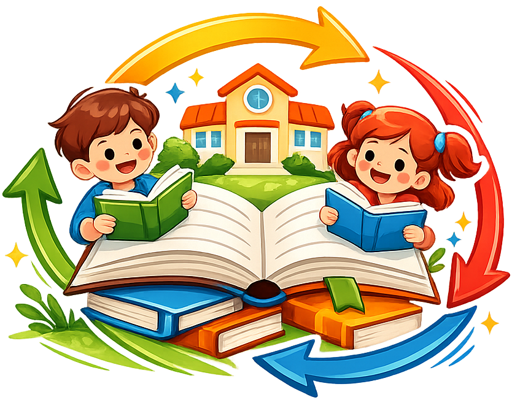

###Libre-libro-teca

#Libre-libro-teca es una aplicación web desarrollada para facilitar el intercambio y la reutilización de libros escolares entre estudiantes y familias.

La idea principal del proyecto es ofrecer una plataforma sencilla donde los usuarios puedan publicar libros que ya no utilizan y encontrar otros que necesiten para el curso siguiente, ayudando así a reducir gastos y fomentar la reutilización de materiales educativos.

#Características principales
- Publicación de libros escolares usados.
- Búsqueda y filtrado de libros disponibles.
- Gestión de usuarios y publicaciones.
- Plataforma enfocada en la reutilización y sostenibilidad.
- Interfaz sencilla e intuitiva.
#Tecnologías utilizadas
##Backend
- PHP
- Laravel
##Frontend
- Blade
- HTML5
- Tailwind CSS
- JavaScript
##Base de datos
- Mysql
##Entorno de desarrollo
- VSCode
- XAMPP
##Control de versiones y herramientas
- Git
- GitHub
#Instalación del proyecto
1 Clonar el repositorio
git clone https://github.com/usuario/libre-libro-teca.git
cd libre-libro-teca
2.Instalar dependencias
composer install
npm install
3.Configurar variables de entorno

4.Copiar el archivo .env.example y crear el archivo .env:

cp .env.example .env

5.Configurar la conexión a la base de datos en el archivo .env.

6.Generar clave de aplicación
php artisan key:generate
7.Ejecutar migraciones
php artisan migrate
8.Iniciar el servidor
php artisan serve

#Objetivo del proyecto

Este proyecto busca fomentar la economía circular dentro del ámbito educativo, facilitando el acceso a libros escolares de segunda mano y promoviendo un consumo más sostenible.

#Estado del proyecto

Proyecto en desarrollo.
